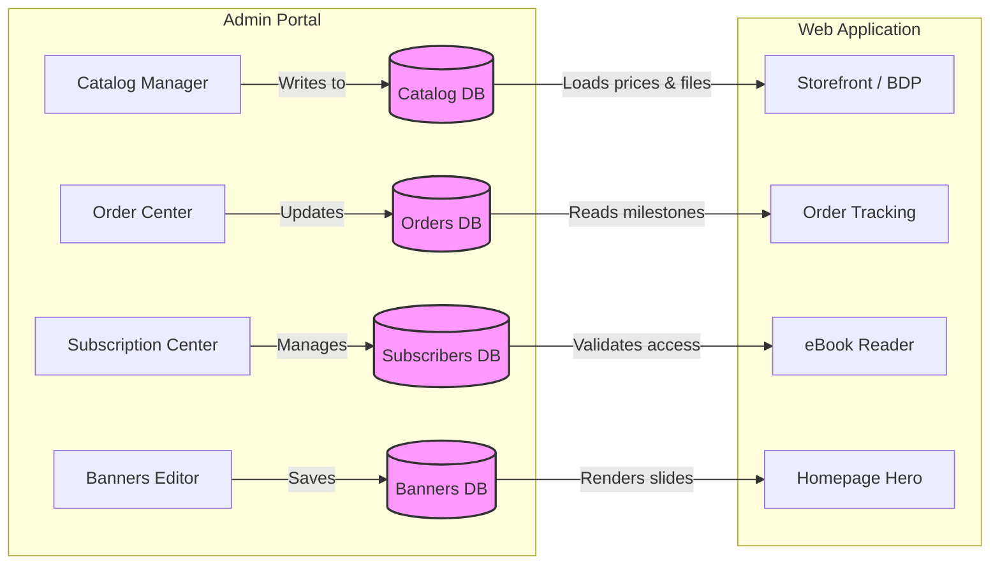

# Gap Analysis: Amrita Books Admin Portal vs. Web Application

This document identifies the functional, architectural, and data synchronization gaps between the **Admin Portal** (internal operations) and the **Web Application** (customer-facing portal). Bridging these gaps will align client experiences with management configurations.

---

## 1. Functional & Feature Gaps

| Feature Area | Admin Portal Configuration | Web Application Implementation | Detected Gap & Discrepancy |
| :--- | :--- | :--- | :--- |
| **Coupon / Discount System** | Support for Coupon Codes, discount types (percentage vs. fixed value), customer usage limits, and category-specific validations. | Cart and Checkout pages do not feature coupon code input boxes or coupon application states. | **High**: Customers cannot redeem admin-configured coupons. Discount validations are not shared. |
| **Regional Pricing** | Regional pricing matrix overrides for physical/digital formats across multiple currencies (INR, USD, EUR, Rest of World). | Simple mock check (`userCountry === 'India' ? '₹' : '$'`) that multiplies base price by 83. | **Medium**: Regional pricing overrides defined in the Catalog catalog are ignored on the client storefront. |
| **Push Notification Delivery** | Push Notification composer to target specific audiences and schedule dispatches (simulates FCM/APNs). | User-facing notification preferences panel. No client-side notification display or FCM service worker. | **High**: Dispatched notifications from the Admin Center have no target client implementation to be received or shown. |
| **eBook Reading Assets** | eBook file uploader (PDF/EPUB) with OCR extraction engine and side-by-side text editor. | eReader displaying mock chapter content. | **High**: Client eReader does not load the actual PDF files or the reviewed OCR text assets generated in Admin. |
| **Refund Ledger & Sync** | Supports full and partial item-level refund processing with balances adjusted in Razorpay simulator. | Order Details page with order receipts. | **Medium**: Customer invoice states do not reflect refund status transitions (`Partially Refunded` or `Refunded`). |
| **Spotlight Banner Sequence** | Configuration form for homepage carousel sequences, quote Author/Citation citations, and CTA links. | Slideshow Carousel with static quotes list. | **Low**: The homepage slideshow sequence is hardcoded and does not load the banners configured by the Admin. |
| **Author Profiles** | Creation of author bios, avatars, and linked catalog directories. | Authors page and Author detail pages. | **Low**: Author directories on the Web App do not load dynamic biographies and cover lists created in Admin. |

---

## 2. Data Synchronization Gaps

### 2.1 Catalog Data Flow
- **Discrepancy**: Admin Portal saves books and regional pricing parameters directly to its local database (`localStorage` key `amrita_books`). Web App retrieves books from a static mock file (`/src/app/data/books.ts`).
- **Required Fix**: Merge the data sources so that the Web App reads the active catalog collection directly from the synchronized local storage store (`amrita_books`), ensuring updates in Admin appear instantly on the storefront.

### 2.2 Order Fulfillment & Courier Tracking
- **Discrepancy**: In the Admin Portal, assigning tracking codes (India Post 13-character or DTDC `N` + 8 digits) sets an order status to `Shipped`. In the Web App, customer order tracking views look up static mocks.
- **Required Fix**: Bind the customer Order Tracking page directly to the common `orders` local storage table, allowing users to track shipment milestones updated by the Admin courier simulator in real-time.

### 2.3 User Accounts & Subscriptions
- **Discrepancy**: Admin Portal manages a customer directory, allocates complimentary plans, and extends or revokes access. The Web App uses a separate `AuthContext` check (`amrita_auth` key) for login and hardcoded subscription states.
- **Required Fix**: Link the Web App's subscription locking mechanisms to check the user's registered profile inside the common `subscribers` database, ensuring validity extensions or revocations take effect immediately.

---

## 3. Recommended Integration Plan

1. **Unify Database Mocking**: Migrate both projects to use a shared virtual database module reading from local storage (or a shared indexedDB store) instead of separate mock files.
2. **Implement Coupon Handler**: Add a `CouponContext` to checkout pages to parse active codes from the coupon database and subtract discounts.
3. **Connect eReader to OCR Outputs**: Set the Reader page to query chapters using the edited OCR text logs generated from the book's Admin catalog card.
4. **Subscribe to FCM Simulators**: Implement a browser notification listener on the Web App to display alert banners when a manual notification is sent from the Admin portal.
