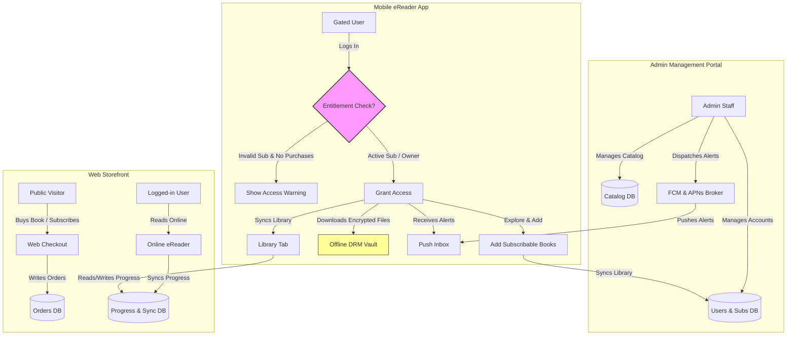

# Gap Analysis: Amrita Books Product Suite
### Admin Portal vs. Web Application vs. Mobile eReader App

This document analyzes the functional scope, authentication rules, and data synchronization gaps across all three systems in the Amrita Books platform.

---

## 1. Persona & Scope Comparison

| Metric | Admin Portal | Web Application | Mobile eReader App |
| :--- | :--- | :--- | :--- |
| **Primary Audience** | Internal staff (Super Admins, Catalog Managers, Fulfillment). | General public, buyers, and subscribers. | Existing eBook buyers and active subscribers *only*. |
| **Registration / Signup** | Created manually by Super Admins via RBAC dashboard. | Self-registration and login on checkout/profile. | **No signup**. Must log in using Web App credentials. |
| **E-Commerce Flows** | Refund processing, courier shipments, coupon codes management. | Full shopping cart, physical & digital checkouts, payment gateway. | **No checkout/billing**. Restricts to reading and adding catalog items. |
| **eReader Capabilities** | OCR text extraction, proofreading, and side-by-side editing. | Online browser-based eReader. | Native eReader with secure offline downloads. |
| **Push Alerts** | Composing, scheduling, targeting, and dispatching. | Notification preferences (on/off toggles). | Native FCM/APNs listener, notification badge, and push inbox. |

---

## 2. Core Functional Gaps

### 2.1 The Gatekeeper Access Logic (Login Restriction)
- **Description**: The Mobile App must reject logins from users who do not own a digital book or hold an active subscription.
- **The Gap**: The current Auth API does not have an entitlement checking mechanism. To support the Mobile App PRD, the `POST /auth/login` endpoint must return a validation error code if the user's account records `digital_purchases.length === 0` and `subscription.status !== 'Active'`.

### 2.2 Subscription "Explore & Add" Workflow
- **Description**: Subscribed users can browse the catalog on the Mobile App and click "Add to Library" directly.
- **The Gap**: The database must support an endpoint to dynamically map a book ID to a user's subscription library profile. This action must synchronize so that the book appears in the "Library" list on both the Web App and the Mobile App.

### 2.3 Shared Reading Progress Sync (eReader Sync)
- **Description**: A user reading a book on the Web App should be able to open the Mobile App offline and see their bookmarks, annotations, and page progress synchronized.
- **The Gap**: Currently, reading progress is stored in independent local storage instances. We require a centralized sync API (`/api/sync/progress`) that records the last-read timestamp, active page index, and custom highlights list per book, handling conflict resolution (e.g. "latest timestamp wins").

### 2.4 Secure Offline DRM (Asset Downloading)
- **Description**: The Mobile App requires downloading books for offline access, encrypted locally via AES-256. The Web App is online-only.
- **The Gap**: The Admin Portal uploads EPUB/PDF book assets. The system must support generating signed, short-lived download URLs for the Mobile App to securely pull the encrypted book files without exposing public paths.

### 2.5 Push Notification Routing
- **Description**: Composed alerts in the Admin Portal must be received by both the Web App and Mobile App.
- **The Gap**: The Admin Portal's simulated dispatch must be connected to a real notification broker. It must register Firebase Cloud Messaging (FCM) tokens for web browsers and mobile devices, routing notifications to native APNs/FCM for the Mobile App and saving them to the user's notification inbox.

---

## 3. Unified Architecture Model

