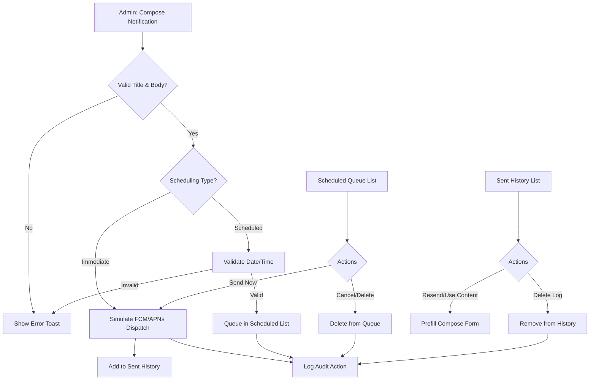

# Product Requirement Document (PRD)
## Amrita Books Admin Portal (Updated)

**Document Version:** 1.0.0  
**Date:** July 8, 2026  
**Status:** Approved  
**Author:** AI Pair Programmer  

---

## 1. Executive Summary & Objectives
The **Amrita Books Admin Portal** is the central operational core for Amrita Books. It provides administrators, monastic members, and fulfillment staff with the necessary interfaces to manage physical and digital catalog items, track customer orders, process subscriptions, configure regional pricing structures, review OCR eBook conversions, administer coupons, monitor financial transactions, and govern team access controls.

### Core Goals:
1. **Catalog Integrity & Multi-Lingualism**: Support physical/digital format configurations, localized metadata for language editions, and regional currency price overrides.
2. **Efficient Order Fulfillment**: Streamline physical shipments, courier API updates, and multi-tier refund processing (full and partial).
3. **Advanced Subscription Lifecycle Control**: Enable plan definitions, manual assignments, complimentary passes, and granular validity adjustments (extensions, plan changes, revocation).
4. **OCR Verification Workspace**: Provide a side-by-side editing interface to review automated OCR text extractions before digital publication.
5. **Auditing & Access Security**: Guard administration actions with Role-Based Access Control (RBAC) and record all configuration updates in a central audit ledger.

---

## 2. System Architecture & Integrations
The Admin Portal operates as a React SPA connected to localized state engines (`localStorage` in simulated environment) and external integrations:
- **Courier Shipping Services**: Bidirectional integration with India Post (validation of 13-char alphanumeric ending in "IN") and DTDC Express (simulated soft-data upload generating consignment numbers like 'N21996707') to trigger customer shipment notifications and automate order completion on delivery.
- **Razorpay Payment Gateway**: Ingests gateway transactions, fees, GST, and handles processing of full and partial refunds with balance tracking.
- **OCR eBook Engine**: Analyzes PDF/EPUB uploads, triggers text extraction, estimates character confidence levels, flags warning/critical script failures, and populates the Review Workspace.

---

## 3. Common UI & Layout Features
- **Sidebar Navigation**: Restricts module links dynamically based on the active admin user's allowed modules profile.
- **RBAC simulation widget**: Located at the bottom of the sidebar. Allows administrators to quickly switch between "Super Admin", "Catalog Manager", and "Inventory Staff" simulation profiles to check layout restriction compliance inline.
- **Account State Interceptor**: If the selected administrator profile status is changed to "Inactive", all routes are blocked, and a full-screen "Account Deactivated" lockout card is displayed.

---

## 4. Detailed Module Requirements

### 4.1 Dashboard
#### Overview & Purpose
Serves as the operational homepage, highlighting key revenue indicators, active subscription tiers, pending physical orders, and critical notifications requiring immediate action.

#### UI & Layout
- **Metric Cards (Top row)**:
  - **Active Subscribers**: Current live subscription count, MoM percentage change indicator, and a green "Live" status badge.
  - **Gross Revenue**: Current month gross revenue, MoM percentage change.
  - **Pending Orders**: Current physical order count awaiting courier tracking assignment, MoM percentage change.
- **Charts Grid (Middle section)**:
  - **Revenue Trend**: Interactive 6-month area chart plotting gross revenue. Includes hover tooltips displaying precise currency figures.
  - **Weekly Orders**: Vertical bar chart comparing daily order counts from Monday through Sunday.
- **Critical Alerts Panel (Bottom section)**: A vertical ledger displaying urgent system events (e.g. Low Stock SKU warning, Failed Delivery RTS notices). Each alert contains:
  - Severity level badge (Warning/Danger).
  - Descriptive alert message (e.g., "Tamil edition of Mahabharata is running out of stock").
  - Actions: **View** (opens the corresponding Catalog or Order details) and **Resolve** (clears alert from dashboard view).

#### Functional Requirements
- MoM calculations are automatically computed based on the comparison of the current month's cumulative value against the preceding month's total.
- Clicking "Resolve" on an alert removes it from local memory, updating the alert count widget.

#### User Stories
##### As an Admin User, I want to view high-level operations metrics on a central dashboard, so that I can monitor the health of the store at a glance.
- **Acceptance Criteria**:
  - The metric cards for Subscribers, Revenue, and Orders must load on dashboard entry.
  - Tooltips on the 6-month area chart must show exact values on hover.
  - Clicking "View" on an alert must redirect the browser to the correct module.
  - Clicking "Resolve" must remove the alert item with a fade animation.

---

### 4.2 Catalog Management (Including OCR Review Workspace)
#### Overview & Purpose
Maintains the book catalog, localized language editions, physical and digital formats, regional pricing matrix, and digital publication assets.

#### UI & Layout
- **Control Bar**: Search input, Region filter dropdown, Language filter dropdown, Category hierarchical filter, Format filter, Status filter, and "Export CSV" button.
- **Book Ledger Table**: Multi-select checkbox column, book cover image, Title, Author, Category badges, Formats available, and Status (Draft/Published) badge.
- **Bulk Actions Drawer**: Appears when checkboxes are selected. Actions: Delete, Change Status, and **Apply Discount**:
  - **Bulk Discount Modal**: Select "Percentage (%)" or "Fixed Amount (₹)" toggle, input value field, and Apply button.
- **Book Creation/Edition Form**: Two-section editor:
  - **Section 1: Book Information (Common)**: Title, Author dropdown (with inline "+ Add New Author" modal), Series dropdown (with inline "+ Add New Series"), Volume input, Related Books selector, Category checkbox tree (displays child directories dynamically when parent is checked), and "Featured Book" toggle.
  - **Section 2: Language Variants**: Accordion listing active language variants. Contains "+ Add Language Variant" dropdown, default variant selector, and remove variant action.
- **Language Variant Card**:
  - Drag-and-drop cover image zone (JPEG/PNG/WebP, up to 5MB, 1:1.5 ratio).
  - Localized Title and Description fields.
  - **Format Toggles**:
    - **Digital Format**: ISBN input, Base Price, Sale Price. eBook file uploader (PDF/EPUB, up to 25MB). Initiates OCR analysis displaying: File size, page count, upload time, OCR Confidence %, pages reviewed ratio, issues found, and health score (Good, Moderate, Poor). Includes "Open Review Workspace" action.
    - **Physical Format**: ISBN, SKU, Base Price, Sale Price, Stock Count, Weight (g), Dimensions (L, W, H in mm), Domestic shipping cost, and International shipping cost.
  - **Regional Pricing Table**: Multi-column grid containing pricing rows for India, US, Europe, and Rest of World. Direct fields to override digital and physical base/sale prices. Contains copy tools: "Copy from Digital Base", "Copy from Physical Base", and "Apply India Pricing to All Regions".

#### OCR Review Workspace
- **Layout**: Full-screen interface:
  - **Left Sidebar**: Page-by-page vertical strip showing status icons (Green Check: Clean, Amber Triangle: Warning, Red Circle: Critical issue).
  - **Center Viewport**: Triple-tab toggle view (Original PDF scan, Extracted Text editable area, Side-by-Side split).
  - **Right Details Panel**: Page-level statistics (OCR Confidence percentage, detected warning list, Re-run OCR action, Ignore/Resolve checkboxes, Progress bar, and Publish Live button).

#### Functional Requirements
- **OCR Health score rules**: Good (Confidence > 90%, 0 critical errors), Moderate (Confidence 75%-90%, < 5 warnings), Poor (Confidence < 75% or 1+ critical errors).
- **Publication Gate**: The "Publish Live" button in the OCR workspace remains disabled if any page has an unresolved "Critical" flag.
- **Bulk Discount Validation**: Bulk discount adjustments cannot reduce sale prices below ₹0.

#### User Stories
##### As a Catalog Manager, I want to add a book with language-specific details and regional prices, so that international store users see appropriate formats and pricing.
- **Acceptance Criteria**:
  - I can upload a PDF and initiate OCR processing.
  - The regional pricing copy tools must populate all country inputs automatically.
  - I can apply bulk discounts to selected rows in either percentage or fixed currency.

##### As an Editor, I want to compare scanned pages with extracted text in a side-by-side workspace, so that I can resolve transcription warnings before publishing.
- **Acceptance Criteria**:
  - Side-by-side view must align PDF page and text editor.
  - Extracted text changes must auto-save to draft.
  - Resolving all critical warnings must enable the "Publish Live" button.

---

### 4.3 Spotlight Banner Management
#### Overview & Purpose
Configures homepage spotlight slides, quotes, background images, and call-to-actions (CTA).

#### UI & Layout
- **Banner Configuration Form**: Left panel displaying title, quotation text, quote author, citation source, preset backdrop selector grid, custom image upload button, catalog book search dropdown (to link book and autofill CTA), and CTA label.
- **Banner Sequence List**: Right panel displaying drag-handles, banner titles, active/inactive switches, and order buttons (Move Up / Move Down).
- **Live Preview Slider**: A responsive mockup mimicking the homepage carousel, allowing previewing of backdrop colors, text layout, and images.

#### Functional Requirements
- Linking a banner to a catalog book automatically generates the CTA path: `/catalog?id={bookId}`.
- Deactivating a slide removes it from the preview carousel, but retains it in the management grid.

#### User Stories
##### As an Admin, I want to configure a spotlight banner with a spiritual quote and link it to a catalog book, so that homepage visitors can browse the featured book.
- **Acceptance Criteria**:
  - Selecting a book from the search dropdown must prefill the quote author and CTA URL.
  - Rearranging display orders using Up/Down buttons must update the active slider sequence instantly.
  - Custom image upload must accept PNG/JPG and convert them to base64 for storage.

---

### 4.4 Author Management
#### Overview & Purpose
Maintains profiles of authors, monastics, and spiritual guides publishing on Amrita Books.

#### UI & Layout
- **Filters**: Search query field, Status filter (Active/Inactive), Category filter (Senior Swamis, Monastics, Others).
- **View Toggles**: Grid layout showing avatar circles and book counts vs. List layout showing data rows.
- **Author Details Panel**: Displays full biography, photo avatar, joined date, status badge, and lists all catalog titles linked to the author.
- **Add/Edit Modal**: Name input, Bio text area, Category select, Status select, Date added picker, and Photo uploader (up to 2MB).

#### Functional Requirements
- Author deletion is blocked if the author has active published books in the catalog.
- If no profile photo is uploaded, the avatar must render the author's initials on a background color derived from the char-code sum of their name.

#### User Stories
##### As a Catalog Administrator, I want to create and manage author profiles, so that books in the catalog can be linked to verified author records.
- **Acceptance Criteria**:
  - Adding a new author with incomplete fields must trigger form error notifications.
  - I can filter authors by category (e.g. Senior Swamis).
  - Deleting an author must require confirmation and verify no books are linked.

---

### 4.5 Order Management
#### Overview & Purpose
Manages sales fulfillment across physical books, eBook deliveries, and subscriptions.

#### UI & Layout
- **Operational Tabs**: All, Physical, Digital, Subscriptions.
- **Filters**: Order Status, Payment Status, Date range, and Search box (Order ID, Customer name, Customer email).
- **Order Details Modal**: Customer contact details, shipping address, ordered items list, billing summary, Razorpay transaction ID, and action tools:
  - **Fulfillment Truck Button**: Triggers shipping assignment inputs (Courier provider dropdown, India Post manual tracking field, or DTDC Express soft-data label generator and cancellation controls).
  - **Full Refund Button**: Inputs optional reason, updates statuses.
  - **Partial Refund Drawer**: Checkboxes to select items, quantity counters, auto-calculated refund total, reason input, and process refund button.
  - **Refund History Logs**: Cards tracking refund dates, amounts, reasons, and items.

#### Functional Requirements
- **Fulfillment validations**:
  - India Post tracking numbers must end with "IN" (e.g., CP123456789IN).
  - DTDC Express tracking numbers must start with 'N'/'n' followed by exactly 8 digits (e.g., N21996707).
- **Fulfillment Controls**: Selecting DTDC Express displays "Generate Shipping Label", "Print Shipping Label" (Base64 courier label preview inside iframe/modal), and "Cancel DTDC Shipment" buttons. Printing shipping labels is blocked if the consignment is unassigned.
- **Fulfillment State**: Assigning a valid tracking number changes the order status to `Shipped` and payment status to `Paid`.
- **Refund calculations**: Partial refund values are capped at the original item unit cost multiplied by refunded quantity. Payment status transitions to `Partially Refunded` or `Refunded` (if total refund equals order value).

#### User Stories
##### As a Fulfillment Staff member, I want to assign tracking numbers to physical orders using Normal or Premium shipping workflows, so that customers receive shipping confirmation and tracking codes.
- **Acceptance Criteria**:
  - Entering non-compliant India Post tracking numbers must block submission.
  - Selecting DTDC Express requires triggering a soft-data upload to generate the consignment reference code.
  - Once DTDC consignment is assigned, printing is enabled (renders print-ready Base64 asset) and cancellation can be toggled to purge the assignment.
  - Successful tracking submissions must update order status to "Shipped".
  - A confirmation notification must display on success.

##### As a Support Admin, I want to issue a partial refund for specific items in an order, so that customers receive exact credit for returned or cancelled items.
- **Acceptance Criteria**:
  - I can select subset items using checkboxes.
  - Adjusting refund quantities must update the refund total dynamically.
  - Processed refunds must appear in the details log.

---

### 4.6 Tracking System
#### Overview & Purpose
Monitors physical parcel statuses by integrating with DTDC Express and India Post logistics client API simulators.

#### UI & Layout
- **Search Header**: Single input box accepting tracking numbers or order reference numbers.
- **Consignment Overview**: Card displaying current status (In Transit, Delivered, Return to Sender, Pending) and carrier name.
- **Milestone Timeline**: Vertical track displaying chronologically sorted events containing: Location details, timestamp, status descriptor, and action comments.
- **Visual Indicators**: Pulsing green dot highlighting the latest event; red alerting for RTS/failed delivery milestones.

#### Functional Requirements
- Tracking details auto-populate when arriving via links from the Order Management screen.
- Contains milestone status simulation controls allowing operators to manually trigger delivery updates.
- When the timeline status is updated to `Delivered`, the parent order status is automatically updated to `Completed` in localStorage, synchronizing the order state.

#### User Stories
##### As an Admin, I want to trace the real-time shipping milestones of a physical book parcel, so that I can answer customer tracking queries.
- **Acceptance Criteria**:
  - Searching a valid tracking number displays the consignment status card.
  - Timeline events must render sequentially with matching date/time.
  - Failed deliveries must trigger red danger banners.

---

### 4.7 User Management
#### Overview & Purpose
Tracks store customer accounts, purchase behaviors, and digital library contents.

#### UI & Layout
- **Customer Directory**: Customer name, email, country, library count, and total spent.
- **Customer Profile View (Drawer/Modal)**:
  - Details panel: Joined date, customer ID, email, location.
  - Library inventory list: Titles of books owned, purchase date, formats owned.
  - Action options: **Send Password Reset Link** (triggers account reset process).

#### Functional Requirements
- Customer spending totals must accumulate all orders marked `Paid` or `Partially Refunded` (deducting refunded amounts).
- Reset link action simulates secure email dispatch, displaying confirmation with the customer's destination address.

#### User Stories
##### As a Support Admin, I want to inspect a customer's profile and purchase history, so that I can troubleshoot access questions about their eBook library.
- **Acceptance Criteria**:
  - Searching by customer email loads the user profile.
  - The library tab displays all purchased digital books.
  - Sending a password reset link displays a dispatch notification.

---

### 4.8 Subscription Management
#### Overview & Purpose
The primary portal for configuring digital subscription plans, enrolling members, assigning complimentary passes, and tracking subscriber activity.

#### UI & Layout
- **Plan Configuration Grid**:
  - Dashed card for **[ + Create New Plan ]** and active plan cards.
  - **Plan Modal Form**: Plan Name, billing duration selector (7, 30, 90, 180, 365 days), Status (Active, Draft, Archived), Description, and regional price override fields.
  - Plan card actions: Currency switcher, Edit Price, Archive/Restore.
- **Subscriber Directory Table**: Name, Email, Plan, Status (Active, Expired, Complimentary, Cancelled), Source (Purchased, Admin Assigned, Complimentary, Promotional), Expiry Date, and Action button (Eye Icon).
- **Subscriber Profile Drawer**: Three main divisions:
  - **Left Section**: Subscriber details, billing source, pricing tier.
  - **Right Section (3-Column Logs)**: Payments Log, Renewal History, and Activity/Audit log.
  - **Action Menu (Footer)**: Extend Validity (+7, +30, +90 days, or custom date), Change Plan, Convert to Paid, Cancel Subscription, and Revoke Access.

#### Functional Requirements
- **Extension rules**: If status is Expired, validity extensions begin from today. If status is Active, extensions append to the current expiry date.
- **Revocation**: Sets subscription status to `Expired` and updates expiry date to today.
- **Complimentary access assigns**: Can be configured by custom duration or target date. Sources: Complimentary, Admin Assigned, Promotional. Campaigns: Amma Event, Volunteer, Ashram Member, Book Launch.

#### User Stories
##### As an Admin, I want to manually enroll a user in a complimentary subscription, so that volunteers and Ashram members can access digital texts during events.
- **Acceptance Criteria**:
  - I can select campaign labels and source tags.
  - Custom validity dates must auto-calculate remaining subscription days.
  - Manual enrollments must create records in both subscription history and audit logs.

##### As an Admin, I want to extend an active subscriber's validity period, so that I can resolve billing errors or award promotional credits.
- **Acceptance Criteria**:
  - Extending active subscriptions must append the new days onto the original expiry date.
  - Extending expired subscriptions must calculate the new expiry starting from today's date.

---

### 4.9 Coupon Management
#### Overview & Purpose
Coordinates store promotions, coupon campaigns, and discount parameters.

#### UI & Layout
- **KPI Summary Cards**: Active Coupons, Total Redemptions, Estimated Savings (₹).
- **Coupon Form Modal**: Code string, Description, Discount Type (percentage or fixed), Discount Value, Expiry Date (with validation), Usage Limit per customer, Applicable Order Type (all, physical, digital), and Status (Active/Inactive).
- **Coupons List Table**: Code, Description, Type, Expiry details (renders countdown warning badges), status toggle switch, and delete action.

#### Functional Requirements
- Expiry indicator rules: Date prior to today shows "Expired" (Red badge). Expiry date within 7 days shows "Expires in X days" (Amber badge). Future expiry shows date (Slate badge).
- Deleting a coupon deletes it from options, but historical logs preserve stats.

#### User Stories
##### As an Admin, I want to create a promotional coupon code, so that I can run sales campaigns for specific book categories.
- **Acceptance Criteria**:
  - Coupon codes must reject spaces and lowercase letters (auto-uppercased).
  - Discount values must be validated: percentage coupons cannot exceed 100%.
  - Saving a coupon must show it immediately in the active promotions list.

---

### 4.10 Reports & Analytics
#### Overview & Purpose
Provides consolidated metrics for Sales, Subscriptions, and Inventory to assist in business analysis.

#### UI & Layout
- **Preset Dates Panel**: 7 Days, 30 Days, This Month, Last Month, and Custom range pickers.
- **Tab Layout**:
  - **Sales Report**: Metric cards for Gross, Sales count, AOV. Recharts pie chart showing channel splits (online, physical, manual), Category bar chart, Language bar chart, and transactions grid. Includes **Print All Invoices** action.
  - **Subscriptions Report**: Renewal rate charts, active/expired totals, and subscription registration logs.
  - **Inventory Report**: SKU stock levels, value of stock, reorder queues.
- **Exports Tool**: CSV, Excel, and PDF downloads.

#### Functional Requirements
- Average Order Value (AOV) is computed as: `Total Revenue / Total Paid Orders`.
- **Print All Invoices**: Compiles all current transaction records in a print stylesheet layout and triggers the native browser print dialog.

#### User Stories
##### As an Administrator, I want to analyze revenue reports filtered by date range and sales channel, so that I can understand which formats and platforms perform best.
- **Acceptance Criteria**:
  - Adjusting the date preset must update all Recharts graph series.
  - Exporting reports must show progress states before files download.
  - Printing invoices must assemble clean sheets containing billing details.

---

### 4.11 Pricing Models
#### Overview & Purpose
Defines pricing regions, currencies, monthly/yearly subscription costs, and country assignments.

#### UI & Layout
- **Country Group Grid**: Displays pricing boxes for regions (e.g. India, Europe, Rest of World).
- **Pricing Group Editor**: Form for Group Name, Currency selector, Monthly rate, Yearly rate, Status, and Country tags search/assign input.
- **Catch-all Region**: Rest of World (USD currency) remains the default region for unassigned countries.

#### Functional Requirements
- **Overlap Prevention**: Assigning a country to a group must verify it is not already in use. A warning is displayed if the country is assigned elsewhere.
- **Delete Group**: Deleting a custom region returns all associated countries to the "Rest of World" catch-all pool.

#### User Stories
##### As an Admin, I want to create a regional pricing group and assign countries to it, so that customers in those countries are charged appropriate subscription rates.
- **Acceptance Criteria**:
  - Creating a group must require currency, monthly price, and yearly price.
  - Assigning a country must remove it from the available lists of other groups.
  - Deleting a group must show a warning and update country mappings.

---

### 4.12 Inventory Management
#### Overview & Purpose
Provides read-only tracking of physical stock counts across warehouse SKUs to assist in inventory audits.

#### UI & Layout
- **Operational Metrics**: Total SKUs tracked, Total stock units, Low Stock Alerts count.
- **Low Stock Notification Card**: An amber warning alert listing book titles, languages, SKUs, and remaining counts for items below threshold levels.
- **Stock Ledger Table**: Columns for SKU, Book Title, Language, Stock Units, Weight (g), and Status badge (In Stock, Low Stock).

#### Functional Requirements
- The low stock threshold is set to a default of 10 units. Any SKU falling below this triggers low stock flags.

#### User Stories
##### As an Inventory Auditor, I want a read-only list of physical stock counts across SKU variants, so that I can verify warehouse logs and trigger reorders.
- **Acceptance Criteria**:
  - The ledger must list SKUs categorized by language and format.
  - Low stock warning badges must highlight any rows with stock counts below 10.
  - Searching by SKU or title filters the ledger.

---

### 4.13 Finance & Reporting
#### Overview & Purpose
Tracks payment gateway details, transaction fees, and net payouts.

#### UI & Layout
- **Financial Cards**: Gross Revenue, Gateway Fees (Razorpay + GST), and Net Payouts.
- **Trend Visualizations**:
  - Revenue Trend: Multi-line chart comparing monthly Gross and Net metrics.
  - Revenue Type: Pie chart splitting Subscriptions, Digital Sales, and Physical Sales.
  - Monthly Breakdown: Bar chart comparing Gross, Payout, and Fees.
- **Accounting Ledger**: Razorpay transaction table displaying: ID, Customer, Type, Gross, Fees, Net, and Date.
- **Exports Dropdown**: Revenue Report, Fees Breakdown, Tax Report.

#### Functional Requirements
- Net Revenue is computed as: `Gross Revenue - Payment Gateway Fees (Razorpay + GST)`.
- Transaction fees are estimated using Razorpay standard pricing (2.36% inclusive of GST).

#### User Stories
##### As a Finance Admin, I want to audit payment gateway transactions and net payout estimations, so that I can reconcile bank accounts.
- **Acceptance Criteria**:
  - The net payout figure must match gross minus fees on the graphs.
  - Recharts hover tooltips must print fees and net values.
  - Clicking export options triggers file generation.

---

### 4.14 Role-Based Access Control (RBAC)
#### Overview & Purpose
Administers portal access and permissions, providing a simulation widget to verify layouts under specific roles.

#### UI & Layout
- **Administrator Table**: Name, Email, Role title, Status toggle (Active/Inactive), Modules allowed count, and actions (Edit, Delete).
- **Edit/Create Drawer**: Form containing Name, Email, Role select, and a multi-select grid of all 15 navigation links to toggle access permissions.
- **Active Simulation Widget (Sidebar bottom)**: Selection dropdown list of registered admin profiles, permitting instantaneous session switching.

#### Functional Requirements
- **Session Interceptor**: If the simulation widget switches to an inactive administrator profile, all navigation is blocked, and the full-screen "Account Deactivated" card is shown.
- Admins cannot delete the profile representing their active simulated session.

#### User Stories
##### As a Super Admin, I want to control the accessible modules for other admin accounts, so that catalog and fulfillment staff only see relevant features.
- **Acceptance Criteria**:
  - Selecting allowed modules must change navigation permissions immediately.
  - Deactivating an administrator account must block their interface access.
  - Switching simulated sessions must update the visible sidebar links.

---

### 4.15 Audit Logs
#### Overview & Purpose
Maintains a security log of administrative actions, edits, and pricing updates.

#### UI & Layout
- **Search and Filter Bar**: Text search, Severity tier selector (Info, Success, Warning, Error), and Module source filter.
- **Logs Ledger**: Chronological feed of log entries, each displaying user name, role badge, target module, description text, timestamp, and severity indicator.
- **Clear Logs Button**: Red button to purge history.

#### Functional Requirements
- Audit log records are created automatically when significant changes occur in other modules (e.g. Catalog updates, RBAC shifts, Subscription revocations).

#### User Stories
##### As a Super Admin, I want to review the audit log feed of administrative updates, so that I can investigate unauthorized modifications.
- **Acceptance Criteria**:
  - Actions like deleting catalog books must append logs.
  - Filtering by module source (e.g. Catalog) must filter logs.
  - Purging history requires confirmation.

---

### 4.16 Consignment Management
#### Overview & Purpose
Provides manual and bulk ingestion utilities for courier tracking codes to automate fulfillment dispatches.

#### UI & Layout
- **Layout**: Two-column top section, full-width bottom table:
  - **Left Panel (Manual)**: Form fields for Order Number, Courier service dropdown, and Tracking number, with "Add Tracking Number" button.
  - **Right Panel (Bulk)**: CSV drop zone with "Upload Files" and "Upload ZIP" actions.
  - **Bottom Table (Audit)**: Consignment records list showing Order Number, Tracking code, and Validation status (Valid/Invalid, with failure details).

#### Functional Requirements
- India Post tracking codes must end in "IN" (13 characters). DTDC Express tracking codes must match a starting 'N'/'n' followed by exactly 8 digits (e.g., N21996707). Invalid entries are flagged in the bottom audit list with descriptive validation errors.

#### User Stories
##### As a Fulfillment Manager, I want to upload CSV tracking lists in bulk, so that multiple orders can be marked dispatched in a single action.
- **Acceptance Criteria**:
  - Uploading a CSV must parse tracking numbers and validate formats.
  - Valid rows must update order statuses to "Shipped".
  - Invalid rows must show validation errors in the audit table.

---

### 4.17 Bulk Ingestion Pipeline
#### Overview & Purpose
An automated eBook ingestion utility to upload, process, and publish catalog items in batches.

#### UI & Layout
- **Upload Dashboard**: Centered drag-and-drop panel containing "Upload Files" (single/batch PDFs) and "Upload ZIP" buttons.
- **Pipeline Progress Bar**: Visual workflow checklist mapping pipeline steps: `1. Upload` -> `2. Extract` -> `3. Draft Queue` -> `4. Publish`.
- **Ingestion Queue Table**: Filename, Status badge (Processing, Draft, Ready, Published), Page count, Upload timestamp, and Action button (e.g., "Preview & Publish" or "Assign Metadata").

#### Functional Requirements
- Files uploaded in `.zip` format extract into individual items in the processing queue.
- Items in `Ready` status open the Catalog editor prefilled with extracted pages, allowing metadata assignment before publishing.

#### User Stories
##### As a Digital Publisher, I want to upload batch PDFs to the ingestion pipeline, so that automated systems can extract eBook text for catalog review.
- **Acceptance Criteria**:
  - Uploaded files must display in the Ingestion Queue table.
  - Queue items in "Processing" status must show loader animations.
  - Items in "Ready" status must provide preview actions.

---

### 4.18 Push Notification Center
#### Overview & Purpose
Allows administrators to compose, target, schedule, and preview push notifications. Helps coordinate marketing campaigns, new release alerts, and live event reminders for store users.

#### UI & Layout
- **Compose Section**:
  - Category type dropdown selector.
  - Target audience dropdown selector.
  - Input field for notification title and textarea for the body (with live character countdowns).
  - Optional action deep-link input with quick preset buttons.
  - Optional media image URL input with quick preset cover options.
  - Scheduling toggle ("Send Immediately" vs. "Schedule for later date/time" with custom date-time picker).
- **Interactive Live Device Preview**:
  - Renders the notification exactly as it would appear on a mobile device.
  - Interactive platform toggle: **Apple iOS** vs. **Google Android**.
  - Binds title, body, and image attachments in real-time.
- **Notification History Log Tab**:
  - List of dispatched notifications, timestamps, audiences, click metrics, and simulated CTR.
  - Action button to duplicate content back into the composer, and action to delete entry from logs.
- **Scheduled Queue Tab**:
  - List of future-scheduled notifications, release times, and statuses.
  - Action to force send immediately and action to cancel/delete queue item.

#### Notification Operations Flow

#### Functional Requirements
- Composing requires non-empty Title and Body inputs. Titles are capped at 65 characters; messages at 180 characters.
- Action triggers (dispatching, scheduling, forcing send, or deleting logs) must record entries to the central Audit Log.
- Duplicating history content pre-fills all composer fields and redirects focus back to the Compose tab.

#### User Stories
##### As an Admin, I want to compose a push notification and preview its display on both iOS and Android platforms in real time, so that I can prevent text clipping on mobile lockscreens.
- **Acceptance Criteria**:
  - Typing in title/body fields updates the mockup text dynamically.
  - Uploading or inputting an image URL renders the image inside the notification box.
  - Toggling platform modes switches visual theme styling instantly.

##### As an Admin, I want to review dispatched notifications and reuse their text, so that I don't have to re-type repeating event announcements.
- **Acceptance Criteria**:
  - Selecting "Use Content" on any log row copies metadata into the composer form and switches to the compose tab.

---

## 5. Non-Functional Requirements

### 5.1 Security & Compliance
- **Session Validation**: Simulated session updates in the dashboard bottom widget must update routing permissions immediately.
- **Deactivation Interception**: Inactive profiles must lock all modules, preventing navigation actions.

### 5.2 Performance & Reliability
- **OCR Processing**: OCR text rendering must handle large files (up to 25MB) without blocking browser UI threads.
- **Recharts Rendering**: Charts must render responsively and dynamically scale with browser window resizes.

### 5.3 Auditability
- Core actions must write entries to the central audit log, including:
  - Catalog deletions.
  - Subscription validity overrides and revocations.
  - Administrator permission modifications.

---

## 6. Future Extensions & Roadmap
1. **Consignment Automation**: Integrate live courier hooks to track shipment dispatches without manual checks.
2. **Bulk OCR Optimizations**: Auto-approve pages with OCR confidence scores above 98%.
3. **Multi-Warehouse Support**: Extend inventory logs to track stock counts across multiple warehouse locations.
