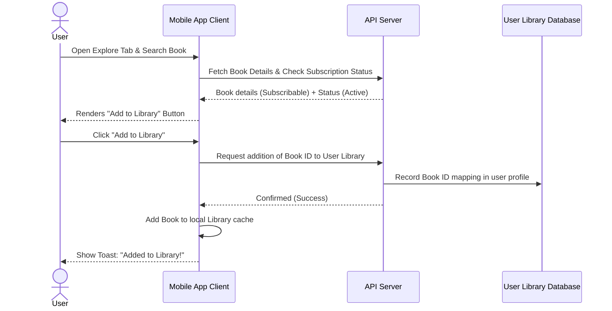

# Product Requirement Document (PRD)
## Amrita Books Mobile Application (Digital Reader Companion)


## 1. Executive Summary & Objectives
The **Amrita Books Mobile Application** is a companion digital eReader designed for mobile devices. The Mobile App has **no self-signup or registration flows** and **no checkout payment options**. It functions exclusively as a gated portal for users who have either purchased eBooks or hold active subscriptions through the Amrita Books web portal.

Its features are strictly limited to:
1. **Library**: Accessing, managing, and reading added eBooks (including secure offline downloads).
2. **Explore**: Browsing the catalog and adding subscribable books directly to the user's library.
3. **Notifications**: Receiving and viewing push notifications.

---

## 2. Gated Authentication & Access Rules
- **Allowed Users**: Customers with at least one digital eBook purchase, or members with an active, unexpired subscription plan.
- **Prohibited Users**: General public and users without active digital book ownership or subscriptions.
- **Sign-up Restriction**: All user accounts must be registered on the Web Portal. Logging in checks credentials; if valid but the user has no digital ownership or active subscription, access is blocked with an explanation redirecting them to the Web Store.

---

## 3. Core Module Requirements

The mobile app layout is structured around 3 primary tabs: **Library**, **Explore**, and **Notifications** (plus a settings slide-out/modal).

```
┌─────────────────────────────────────────┐
│  [Explore / Search]                     │
├─────────────────────────────────────────┤
│                                         │
│               Main View                 │
│         (Library / Explore / Alerts)    │
│                                         │
├─────────────────────────────────────────┤
│  [Library]     [Explore]  [Notifications]│
└─────────────────────────────────────────┘
```

### 3.1 Gated Login Page
- Email and password inputs with validation checks.
- Restricted accounts show a warning overlay:
  > **Access Restricted**  
  > The Amrita Books Mobile App is a companion eReader reserved for eBook owners and active subscribers. Please purchase an eBook or subscribe on our website to continue.

### 3.2 Library Tab (My Books & eReader)
- **Library Grid**: Displays covers of books currently in the user's library (either purchased or added from the Explore tab).
  - Tapping a book opens the eBook Reader.
  - Includes a download trigger to pull books locally to the device for **Offline Reading**.
- **Secure Offline Storage**: Downloaded book files are stored securely in the app, preventing access from external file managers.
- **Built-in eBook Reader**:
  - Full-screen distraction-free reader interface.
  - Page-turning swipe gesture or margin taps.
  - Customizer Panel: Theme toggles (Light, Sepia, Night), font sizing, and font selection.
  - Bookmarks & Highlights: Save quotes and earmark page counts. Syncs to the cloud when connected to the internet.

### 3.3 Explore Tab (Discover & Add Books)
- **Catalog Browsing**: Lists the digital books available in the Amrita Books catalog. Allows filtering by language, category, or title search.
- **"Add to Library" Action**:
  - **For Active Subscribers**: Digital-subscribable books feature an **[ Add to Library ]** button. Clicking this instantly updates their subscription library state and adds the book to their Library tab without any checkout forms.
  - **For Non-Subscribers**: Shows a disabled status or a **[ Purchase on Website ]** notice for purchasable eBooks that are not owned.

### 3.4 Notifications Tab (Inbox Ledger)
- Displays a chronological list of push alerts sent from the Admin Portal (e.g. Satsang announcements, new book releases).
- Integrates with the mobile device's push notification system to receive alerts in the background.
- Tapping a notification redirects the user to the target book page inside the Explore tab or immediately opens it in the eReader if it's already in their Library.

### 3.5 Settings Modal
- Renders read-only user account information.
- Storage utility: Displays disk space occupied by cached books, with a "Clear Downloaded Files" option.
- Manual sync trigger and Log Out.

---

## 4. Operational Workflows & Sync Engine

### 4.1 "Explore & Add" Subscription Sync Flow


### 4.2 Syncing Engine
- Handles syncing of reading progress (page indexes, bookmarks, highlights) between the Web and Mobile app.
- Checks subscription validations periodically; if a user's subscription expires on the Web database, the Mobile app locks access to downloaded subscription books during the next online check.
- Supports offline reading progress saving; when offline, bookmarks and progress are cached locally and merged with the server database when an internet connection is restored.
